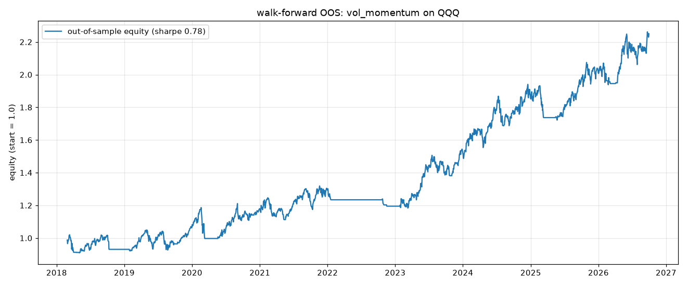

# quantlab — Multi-Market Strategy Backtesting & Research Engine

**A Python research engine for testing trading strategies across US equities, crypto, and Polymarket prediction markets — built around walk-forward out-of-sample validation, because the point is to *reject* overfit strategies, not to produce pretty in-sample equity curves.**

Most backtesting toys will happily show you a 300% return that evaporates the moment you trade it. This one is designed to catch that: every result is charged realistic costs, every signal trades on the *next* bar, and the headline number is out-of-sample.



## Why this project exists

Backtests lie in three common ways. quantlab is built to close each hole:

| Failure mode | How the engine prevents it |
|---|---|
| **Look-ahead bias** — trading on a signal at the same bar it appears | Positions are `shift(1)`ed: a signal on bar *t* is filled on bar *t+1* |
| **Ignoring frictions** — costless backtests that die on real fees | Fee (default 0.1%) and slippage (default 0.05%) charged on turnover, plus round-trip cost accounting per trade |
| **Overfitting** — tuning parameters until the past looks great | Anchored walk-forward: parameters are optimized on a training window, then traded **unchanged** on data the optimizer never saw. Only the stitched out-of-sample equity counts |

Every strategy is also scored against a **buy-and-hold benchmark** on the same asset. A strategy that can't beat holding the asset isn't a strategy.

## Architecture

```
quantlab/
├── data/          yfinance (equities), crypto, Polymarket CLOB; on-disk caching
├── engine/        vectorized backtester + metrics
├── research/      grid-search optimizer, anchored walk-forward validation
├── strategies/    7 strategies behind one Strategy interface + registry
└── report.py      matplotlib equity/drawdown/position charts
main.py            CLI: backtest · scan · optimize · walkforward · pm-search
experiments/       standalone research studies (see below)
```

Strategies implement one method — `generate_positions(prices) -> Series` in `[-1, 1]` — and declare a `param_grid`. Registering a new strategy in `strategies/__init__.py` makes it automatically available to the optimizer, the scanner, and walk-forward validation. No changes to the engine.

## Metrics reported

Total return · CAGR · **Sharpe** · Sortino · **max drawdown** · Calmar · win rate · profit factor · trade count — for both the strategy and the buy-and-hold benchmark.

## The five commands

```bash
# 1. Backtest one strategy, net of fees and slippage, vs buy & hold
python main.py backtest --market crypto --symbol BTC-USD --strategy sma_cross
python main.py backtest --market stock --symbol AAPL --strategy rsi_reversion --params window=14,lower=30

# 2. Sweep many symbols x many strategies to find where signal might exist
python main.py scan --market stock --symbols QQQ,SPY,NVDA,TSLA

# 3. Grid-search one strategy's parameters (in-sample)
python main.py optimize --market crypto --symbol ETH-USD --strategy momentum

# 4. Walk-forward out-of-sample validation  <-- the one that matters
python main.py walkforward --market stock --symbol QQQ --strategy sma_cross

# 5. Search Polymarket for a market, then backtest its YES token
python main.py pm-search --query "fed"
python main.py backtest --market polymarket --symbol <yes_token_id> --strategy momentum
```

`walkforward` reports **in-sample vs out-of-sample Sharpe per fold**, which is the fastest way to see overfitting: a strategy whose IS Sharpe is 2.5 and OOS Sharpe is 0.1 has been curve-fit, not discovered.

## Built-in strategies

| Name | Type | Logic |
|---|---|---|
| `buy_hold` | Benchmark | Always long — the bar every other strategy must clear |
| `sma_cross` | Trend | Long when the fast moving average is above the slow one |
| `momentum` | Momentum | Long when trailing N-bar return is positive |
| `rsi_reversion` | Mean reversion | Buy oversold RSI, exit on recovery |
| `bollinger` | Mean reversion | Buy below the lower band, exit at the middle band |
| `vol_momentum` | Momentum + risk control | Long on positive momentum, sized as target vol ÷ realized vol (higher volatility → smaller position) |
| `donchian` | Breakout | Enter on an N-bar high, exit on an M-bar low (turtle-style) |

## Research experiments (`experiments/`)

Standalone studies that use the engine rather than extend it:

- **`portfolio_2026.py`** — a 50/50 QQQ + BTC volatility-targeted momentum portfolio, scored **only on walk-forward out-of-sample returns**
- **`polymarket_favorite_bias.py`** — tests the favorite–longshot bias on *resolved* Polymarket markets (does the crowd systematically overprice favorites?)
- **`crypto_rotation.py`** — weekly top-N momentum rotation across altcoins, with an honest split: parameters chosen on pre-2023 data, validated on 2024+
- **`leverage_sweep.py`** — sweeps 1x–4x leverage over already-validated out-of-sample returns to show the return/drawdown tradeoff

## Setup

```bash
python -m venv venv
venv/Scripts/pip install -r requirements.txt   # Windows
python main.py --help
```

Dependencies are deliberately small: `pandas`, `numpy`, `matplotlib`, `yfinance`, `requests`.

## Adding a strategy

```python
# quantlab/strategies/my_strategy.py
class MyStrategy(Strategy):
    param_grid = {"window": [10, 20, 50]}

    def generate_positions(self, prices: pd.DataFrame) -> pd.Series:
        ...  # return a Series in [-1, 1]
```

Register it in `strategies/__init__.py` and the optimizer, scanner, and walk-forward runner pick it up automatically.

## Honest limitations

- Backtests charge a flat fee and slippage; they do **not** model market impact, partial fills, or borrow costs for shorts.
- Equity and crypto data come from `yfinance`; survivorship bias is not corrected for.
- Polymarket price history is thin for low-volume markets — treat those results as directional at best.
- **Historical performance does not predict future returns.** This is a research tool, not investment advice.

## Why I built it

I wanted a place to test market ideas where the default answer is "no." Most of what I've run through it does *not* survive walk-forward validation — which is the point. The engine's job is to make that verdict cheap and fast to reach.
